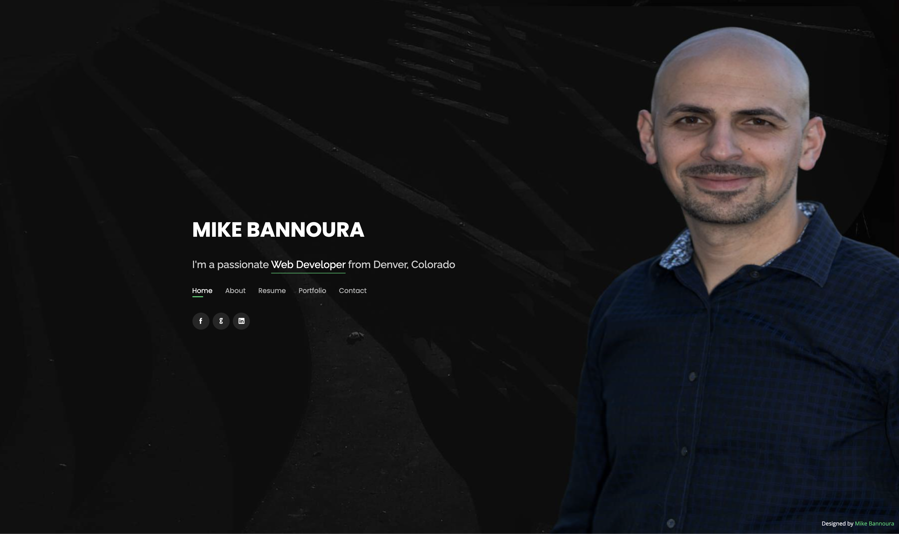
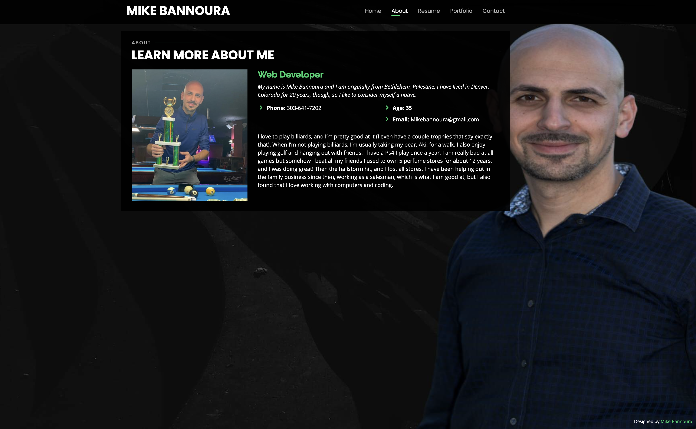
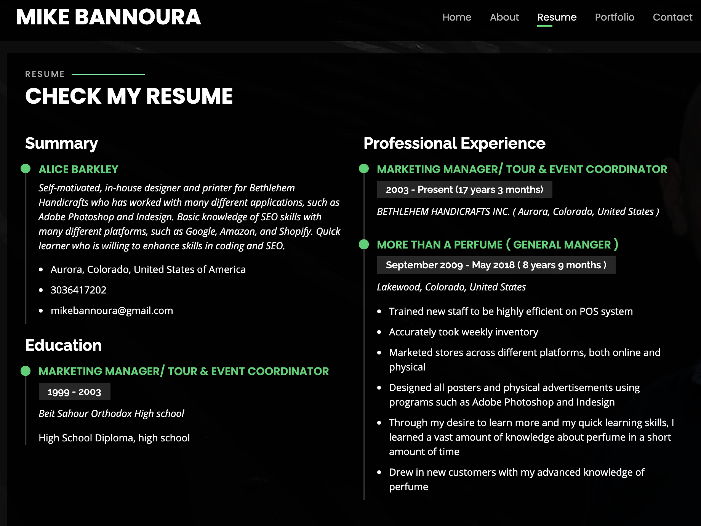
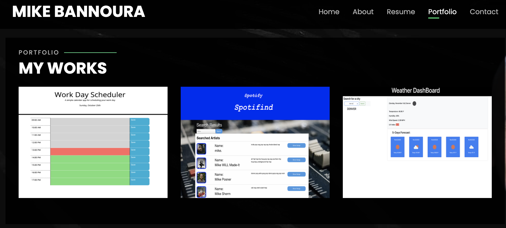
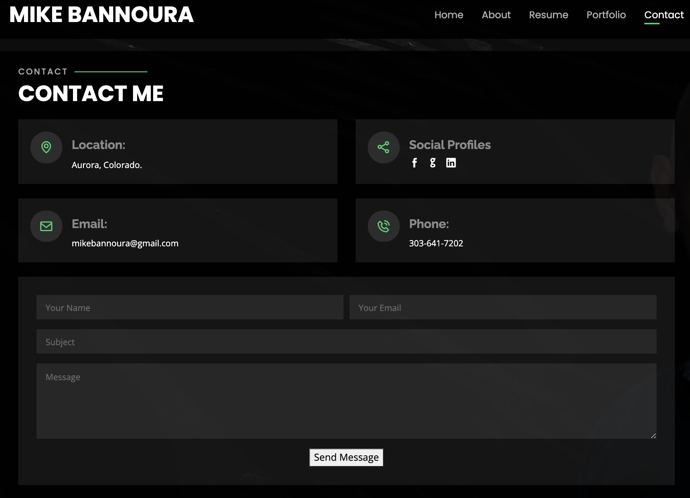

# Mike Bannoura Portfolio and Bootstrap Responsive Bio

Responsive design ensures that web applications render well on a variety of
devices and window or screen sizes. As a developer,

## Project Descriptions

Mike B portfolio three projects.

### built with

- Bootstrap
- HTML
- CSS
- JS

##### Github repo

https://github.com/bannoura9/Bannoura-new-portfolio

##### deployed application

https://bannoura9.github.io/Bannoura-new-portfolio/

  
  

